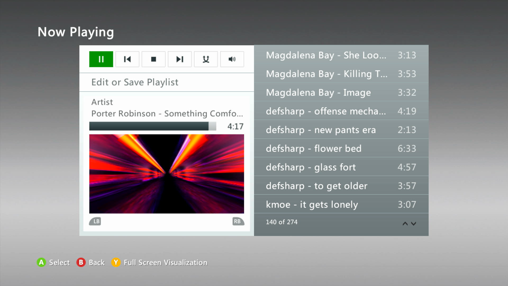

# Reverse engineering of mindex for the Xbox 360 Music Player
Converts songs to FMIM format and generates a mindex.xmi file

To run, have Node.js and FFmpeg installed and run `node .` with all your songs in the `tracks` directory (you may need to create this directory), then place the mindex directory onto the root of your Xbox 360's HDD