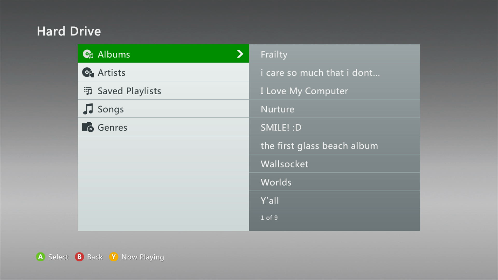
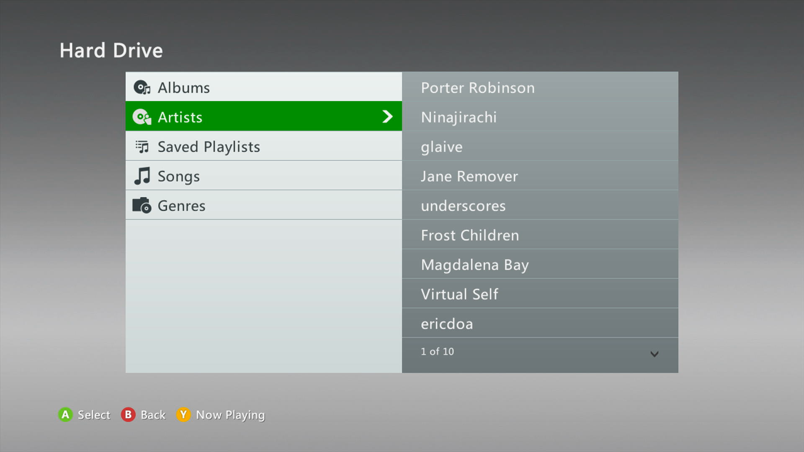
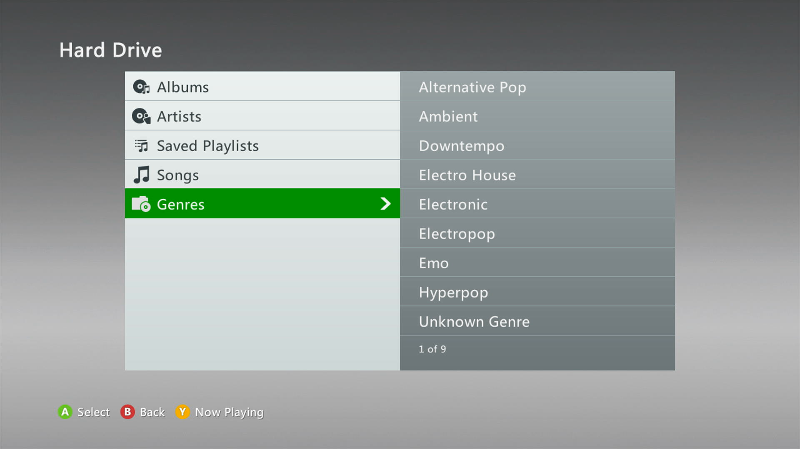
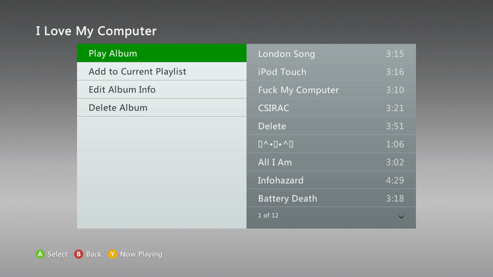

# Mindex Creator
Converts songs for use on the Xbox 360's Music Player

## Screenshots

## Usage
Have [Node.js](https://nodejs.org/) and [FFmpeg](https://ffmpeg.org/) installed then run `node .` with all your songs in the `tracks` directory (you may need to create this directory), then place the created `mindex` directory onto the root of your Xbox 360's HDD

## Tips
* You can add more songs later without overwriting everything (which takes a while) by changing `sortType` to `date` and `sortDirection` to `ascending` in `config.json` then copying the new mindex without overwriting existing FMIM files (the `media` directory)
