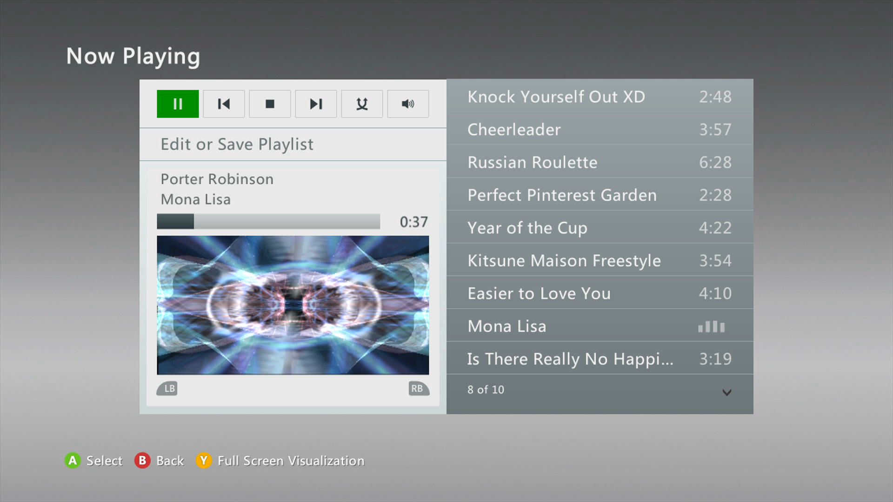

# Xbox 360 Mindex Creator
Simple command-line tool to convert all of your downloaded songs for use on the Xbox 360's built-in Music Player!

## Screenshots

|  |  |
| ------------------------ | ------------------------- |
|  |   |

## Requirements
* [FFmpeg](https://ffmpeg.org/download.html) (included in releases)

## Usage
Run the creator executable with all of your songs in the `tracksPath` directory (see [Configuration](#configuration)) and copy the generated `mindex` directory to the root of your Xbox 360's hard drive

## Configuration
* `defaultTrack` - The track name used if there is no `title` tag, uses file name if null
* `defaultAlbum` - The album name used if there is no `album` tag
* `defaultArtist` - The artist name used if there is no `artist` tag
* `defaultGenre` - The genre name used if there is no `genre` tag
* `artistSeperators` - Characters used to split multiple artist names
* `genreSeperators` - Characters used to split multiple genre names
* `artistJoin` - Replaces artist seperator characters with this
* `genreJoin` - Replaces genre seperator characters with this
* `useSingleArtist` - Only uses the first artist
* `useSingleGenre` - Only uses the first genre
* `keepTracks` - Keeps WMA track files and creates a manifest file to include in later conversions
* `checkOriginalFiles` - Skips manifest entries if the original track file no longer exists
* `backupExistingMindex` - Renames existing mindex folders to avoid overwriting
* `tracksPath` - Put your songs here!
* `wmaOutputPath` - Where converted WMA track files go
* `manifestOutputPath` - Where the generated manifest file goes if `keepTracks` is true
* `mindexOutputPath` - Where the mindex folder itself is located, this goes on your Xbox 360's hard drive
* `extensions` - Supported file extensions, can be anything supported by FFmpeg
* `ffmpegPath` - Path of FFmpeg